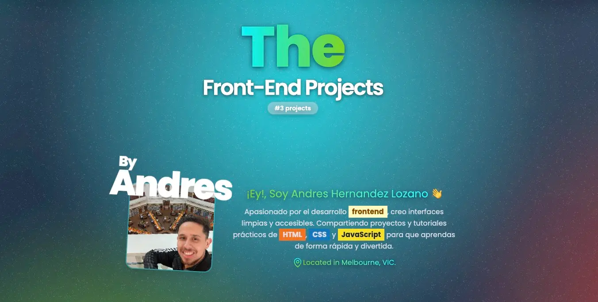

# 🚀 The Frontend Projects

[](https://github.com/soyandresdev/the-frontend-projects)
[](https://soyandresdev.com/demo)
[](https://github.com/soyandresdev/the-frontend-projects)
[](https://github.com/soyandresdev)
[](LICENSE)

> Un repositorio organizado tipo **monorepo** que contiene mis microproyectos, pruebas visuales y landings frontend interactivas, creadas con HTML, CSS, JavaScript, Vite, Astro y GSAP.

---

## ✨ Vista general



---

## 📁 Estructura del workspace

```bash
workspace/
├── 01-css_cards_hover_effects/
├── 02-landingpage_3d_restaurant/
├── 03-scroll-animation/
└── ...
```

Cada carpeta representa un proyecto independiente, con su propio `index.html`, `style.css`, assets, y en algunos casos un `vite.config.js`.

---

## 🧠 Proyectos destacados

| Proyecto                          | Descripción                                                 | Demo                                                              |
| --------------------------------- | ----------------------------------------------------------- | ----------------------------------------------------------------- |
| 🍜 **3D Restaurant Landing Page** | Landing con modelo 3D usando Three.js                       | [ver](https://soyandresdev.com/demo/02-landingpage_3d_restaurant) |
| 🏁 **Neon Velocity**              | Landing de auto futurista con scroll animado frame-by-frame | [ver](https://soyandresdev.com/demo/03-scroll-animation)          |
| ✨ **Cards Hover Effects**        | Tarjetas visuales con efectos CSS modernos                  | [ver](https://soyandresdev.com/demo/01-css_cards_hover_effects)   |

---

## 🛠️ Tecnologías comunes

<div style="display: flex; gap: 10px; flex-wrap: wrap;">
  
</div>

- HTML5 + CSS3
- Vanilla JS / Astro / Vite
- Three.js / WebGL
- GSAP + ScrollTrigger
- Tailwind CSS

---

## 📦 Cómo correr un proyecto

```bash
# Clona este repositorio
git clone https://github.com/soyandresdev/the-frontend-projects.git
cd the-frontend-projects

# Entra a un proyecto individual
cd workspace/03-scroll-animation

# Instala dependencias si es necesario
npm install

# Corre en modo desarrollo
npm run dev
```

---

## 🌐 Enlace general a demos

> Puedes ver todos los proyectos desde:  
> 🔗 [soyandresdev.com/demo](https://soyandresdev.com/demo)

---

## 👨‍💻 Autor

**Andres Hernandez**  
📧 soyandresdev@gmail.com  
🔗 [@soyandresdev](https://github.com/soyandresdev)

---

Made with ❤️ and lots of caffeine ☕
