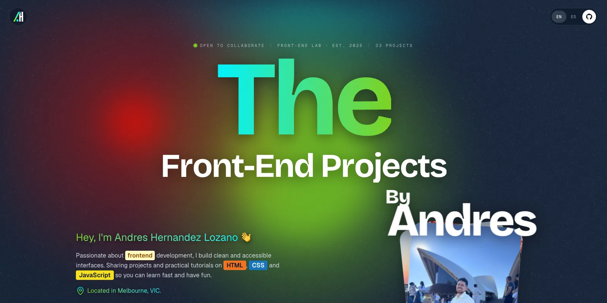
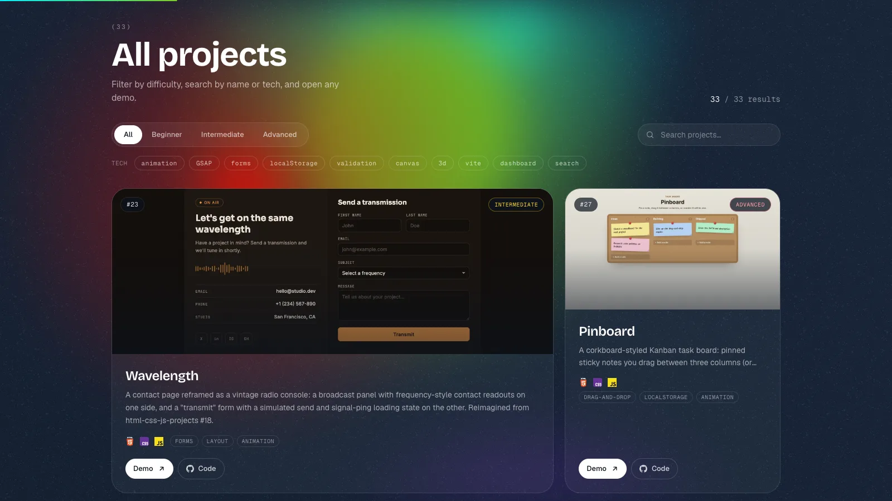
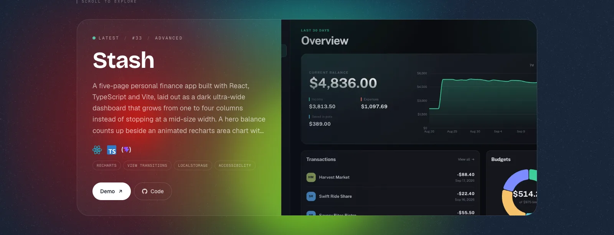
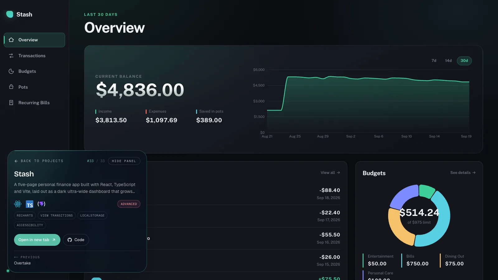

# The Frontend Projects

[](https://thefrontendprojects.soyandres.dev)
[](https://github.com/soyandresdev/the-frontend-projects/commits/main)
[](https://astro.build)
[](https://gsap.com)
[](https://github.com/soyandresdev)

> A living gallery of hand-built frontend experiments. Original designs, GSAP motion and real interactions, from vanilla JS to React + TypeScript, served from one Astro site.



**The Frontend Projects** is a monorepo and live showcase of self-contained frontend builds, each one a small product rather than a tutorial copy. Every project starts from a functional brief, then gets its own name, an original visual identity and purposeful animation: a scroll-progress bar becomes an ink-drawing indicator, a pokemon viewer becomes a clamshell handheld that boots up on screen, and a personal finance app becomes an ultra-wide dark dashboard with animated charts.

The collection deliberately spans the whole difficulty ladder. Early entries are focused vanilla HTML, CSS and JavaScript pieces. Later entries take on Frontend Mentor's Advanced and Guru tiers and move to React, TypeScript and Vite, with the same bar for motion and craft. Throughout, GSAP handles timelines, Flip shared-element transitions and scroll-driven sequences, and the standing rule is to design for large displays first: fluid type scales, explicit grid columns and layouts verified at 1440, 1920 and 2560 pixels.

Browse everything at **[thefrontendprojects.soyandres.dev](https://thefrontendprojects.soyandres.dev)** (English and Spanish).

---

## Highlights

- **Original, not copied.** Each project is reimagined from a brief with its own name, palette and interaction model. Nothing is a paste of reference code.
- **Motion with intent.** GSAP timelines, Flip transitions, FLIP-based reordering, canvas and CSS animation, all with a `prefers-reduced-motion` variant.
- **Built for big screens.** Fluid `clamp()` type scales, explicit grid columns per breakpoint, no 1200px content cap.
- **Growing stack.** Vanilla HTML/CSS/JS at the start, Three.js and GSAP in the middle, React + TypeScript + Vite for the Advanced and Guru challenges.
- **One site, zero manual wiring.** Drop a folder into `workspace/`, run the build script, and the project gets compiled, screenshotted and published under `/demo/<slug>` with its own detail page.



---

## Projects

Difficulty follows the site's three tiers. Stack is the main runtime of each demo.

| # | Project | Difficulty | Stack | Tech | Links |
| --- | --- | --- | --- | --- | --- |
| 01 | **CSS Cards Hover Effects** | beginner | Vanilla | `hover` `cards` | [demo](https://thefrontendprojects.soyandres.dev/demo/01-css_cards_hover_effects/) · [details](https://thefrontendprojects.soyandres.dev/projects/01-css_cards_hover_effects/) |
| 02 | **CyberNoodles — 3D Restaurant Landing** | advanced | Three.js | `ThreeJs` `GSAP` `ScrollTrigger` | [demo](https://thefrontendprojects.soyandres.dev/demo/02-landingpage_3d_restaurant/) · [details](https://thefrontendprojects.soyandres.dev/projects/02-landingpage_3d_restaurant/) |
| 03 | **Scroll-Animated Landing Page** | intermediate | Vanilla | `scroll animation` `GSAP` `vite` | [demo](https://thefrontendprojects.soyandres.dev/demo/03-scroll-animation/) · [details](https://thefrontendprojects.soyandres.dev/projects/03-scroll-animation/) |
| 04 | **Pulse Quiz** | beginner | Vanilla | `GSAP` `quiz` `animation` | [demo](https://thefrontendprojects.soyandres.dev/demo/04-quiz-game/) · [details](https://thefrontendprojects.soyandres.dev/projects/04-quiz-game/) |
| 05 | **Inkline** | beginner | Vanilla | `scroll` `progress` `animation-timeline` | [demo](https://thefrontendprojects.soyandres.dev/demo/05-inkline/) · [details](https://thefrontendprojects.soyandres.dev/projects/05-inkline/) |
| 06 | **Strongbox** | intermediate | Vanilla | `password` `forms` `validation` | [demo](https://thefrontendprojects.soyandres.dev/demo/06-strongbox/) · [details](https://thefrontendprojects.soyandres.dev/projects/06-strongbox/) |
| 07 | **Masthead** | beginner | Vanilla | `team` `editorial` `grid` | [demo](https://thefrontendprojects.soyandres.dev/demo/07-masthead/) · [details](https://thefrontendprojects.soyandres.dev/projects/07-masthead/) |
| 08 | **Stray** | intermediate | Vanilla | `404` `drag` `spring physics` | [demo](https://thefrontendprojects.soyandres.dev/demo/08-stray/) · [details](https://thefrontendprojects.soyandres.dev/projects/08-stray/) |
| 09 | **Flapboard** | intermediate | Vanilla | `countdown` `split-flap` `Web Animations API` | [demo](https://thefrontendprojects.soyandres.dev/demo/09-flapboard/) · [details](https://thefrontendprojects.soyandres.dev/projects/09-flapboard/) |
| 10 | **Noughts** | beginner | Vanilla | `game` `tic-tac-toe` `neubrutalism` | [demo](https://thefrontendprojects.soyandres.dev/demo/10-noughts/) · [details](https://thefrontendprojects.soyandres.dev/projects/10-noughts/) |
| 11 | **Presence** | beginner | Vanilla | `avatars` `tooltip` `presence` | [demo](https://thefrontendprojects.soyandres.dev/demo/11-presence/) · [details](https://thefrontendprojects.soyandres.dev/projects/11-presence/) |
| 12 | **Tally** | beginner | Vanilla | `dashboard` `stats` `count-up` | [demo](https://thefrontendprojects.soyandres.dev/demo/12-tally/) · [details](https://thefrontendprojects.soyandres.dev/projects/12-tally/) |
| 13 | **Eclipse** | intermediate | Vanilla | `dark mode` `view transitions` `theming` | [demo](https://thefrontendprojects.soyandres.dev/demo/13-eclipse/) · [details](https://thefrontendprojects.soyandres.dev/projects/13-eclipse/) |
| 14 | **Ticker** | intermediate | Vanilla | `dashboard` `crypto` `sparkline` | [demo](https://thefrontendprojects.soyandres.dev/demo/14-ticker/) · [details](https://thefrontendprojects.soyandres.dev/projects/14-ticker/) |
| 15 | **Popper** | intermediate | Vanilla | `canvas` `confetti` `particles` | [demo](https://thefrontendprojects.soyandres.dev/demo/15-popper/) · [details](https://thefrontendprojects.soyandres.dev/projects/15-popper/) |
| 16 | **Cardface** | intermediate | Vanilla | `forms` `validation` `3d` | [demo](https://thefrontendprojects.soyandres.dev/demo/16-cardface/) · [details](https://thefrontendprojects.soyandres.dev/projects/16-cardface/) |
| 17 | **Crumb** | beginner | Vanilla | `cookies` `consent` `localStorage` | [demo](https://thefrontendprojects.soyandres.dev/demo/17-crumb/) · [details](https://thefrontendprojects.soyandres.dev/projects/17-crumb/) |
| 18 | **Stopover** | intermediate | Vanilla | `search` `autocomplete` `countries` | [demo](https://thefrontendprojects.soyandres.dev/demo/18-stopover/) · [details](https://thefrontendprojects.soyandres.dev/projects/18-stopover/) |
| 19 | **Nametag** | intermediate | Vanilla | `search` `autocomplete` `animation` | [demo](https://thefrontendprojects.soyandres.dev/demo/19-nametag/) · [details](https://thefrontendprojects.soyandres.dev/projects/19-nametag/) |
| 20 | **Boothstrip** | intermediate | Vanilla | `avatar` `canvas` `animation` | [demo](https://thefrontendprojects.soyandres.dev/demo/20-boothstrip/) · [details](https://thefrontendprojects.soyandres.dev/projects/20-boothstrip/) |
| 21 | **Umbra** | beginner | Vanilla | `css-generator` `range-input` `clipboard` | [demo](https://thefrontendprojects.soyandres.dev/demo/21-umbra/) · [details](https://thefrontendprojects.soyandres.dev/projects/21-umbra/) |
| 22 | **Sealed** | beginner | Vanilla | `forms` `validation` `animation` | [demo](https://thefrontendprojects.soyandres.dev/demo/22-sealed/) · [details](https://thefrontendprojects.soyandres.dev/projects/22-sealed/) |
| 23 | **Wavelength** | intermediate | Vanilla | `forms` `layout` `animation` | [demo](https://thefrontendprojects.soyandres.dev/demo/23-wavelength/) · [details](https://thefrontendprojects.soyandres.dev/projects/23-wavelength/) |
| 24 | **Ledger** | intermediate | Vanilla | `localStorage` `forms` `animation` | [demo](https://thefrontendprojects.soyandres.dev/demo/24-ledger/) · [details](https://thefrontendprojects.soyandres.dev/projects/24-ledger/) |
| 25 | **Beltline** | intermediate | Vanilla | `cart` `state` `animation` | [demo](https://thefrontendprojects.soyandres.dev/demo/25-beltline/) · [details](https://thefrontendprojects.soyandres.dev/projects/25-beltline/) |
| 26 | **Bureau** | intermediate | Vanilla | `currency` `conversion` `animation` | [demo](https://thefrontendprojects.soyandres.dev/demo/26-bureau/) · [details](https://thefrontendprojects.soyandres.dev/projects/26-bureau/) |
| 27 | **Pinboard** | advanced | Vanilla | `drag-and-drop` `localStorage` `animation` | [demo](https://thefrontendprojects.soyandres.dev/demo/27-pinboard/) · [details](https://thefrontendprojects.soyandres.dev/projects/27-pinboard/) |
| 28 | **Scanline** | advanced | Vanilla | `canvas` `QR code` `export` | [demo](https://thefrontendprojects.soyandres.dev/demo/28-scanline/) · [details](https://thefrontendprojects.soyandres.dev/projects/28-scanline/) |
| 29 | **Swatchbook** | advanced | Vanilla | `color-theory` `accessibility` `clipboard` | [demo](https://thefrontendprojects.soyandres.dev/demo/29-swatchbook/) · [details](https://thefrontendprojects.soyandres.dev/projects/29-swatchbook/) |
| 30 | **Mise** | advanced | Vanilla | `GSAP` `API` `localStorage` | [demo](https://thefrontendprojects.soyandres.dev/demo/30-mise/) · [details](https://thefrontendprojects.soyandres.dev/projects/30-mise/) |
| 31 | **Dex Unit 01** | advanced | Vanilla | `GSAP` `API` `3d-transforms` | [demo](https://thefrontendprojects.soyandres.dev/demo/31-pokedex/) · [details](https://thefrontendprojects.soyandres.dev/projects/31-pokedex/) |
| 32 | **Overtake** | advanced | Vanilla | `GSAP` `FLIP` `animation` | [demo](https://thefrontendprojects.soyandres.dev/demo/32-overtake/) · [details](https://thefrontendprojects.soyandres.dev/projects/32-overtake/) |
| 33 | **Stash** | advanced | React + TS | `React` `TypeScript` `Vite` | [demo](https://thefrontendprojects.soyandres.dev/demo/33-stash/) · [details](https://thefrontendprojects.soyandres.dev/projects/33-stash/) |
| 34 | **Cielo Negro — Rap Album Site** | advanced | Three.js | `GSAP` `WebGL` `i18n` | [demo](https://thefrontendprojects.soyandres.dev/demo/34-black-sky/) · [details](https://thefrontendprojects.soyandres.dev/projects/34-black-sky/) |

Newer projects sit at the bottom. The latest one is always featured on the homepage.



---

## The site

The showcase is an [Astro 5](https://astro.build) site with English and Spanish routes, page transitions via Astro's ClientRouter, and a GSAP motion layer (ScrollTrigger, SplitText, Flip).

- **Hero** with a giant gradient title, bio and a photo deck that shuffles on click.
- **Bento project grid** with wide slots, per-project accent colours computed at build time with `sharp`, and animated difficulty/tech filters powered by GSAP Flip.
- **Featured "Latest" card** that always shows the newest project large, above the grid.
- **Detail page per project** that runs the demo full screen, with a floating panel in the project's accent colour: description, tech logos, tags, demo and source links, and previous/next navigation.
- **Custom cursor** that picks up each project's accent colour.



```bash
workspace/
├── 01-css_cards_hover_effects/   # vanilla: index.html + style.css + script
├── 02-landingpage_3d_restaurant/ # Vite + Three.js
├── ...
└── 33-stash/                     # React + TypeScript + Vite
    ├── DATA.md                   # title, description (en/es), difficulty, keywords
    ├── src/
    └── package.json
```

Every project folder carries a `DATA.md` front matter file. The generator script turns those into `src/consts.ts`, and the demo builder compiles each folder (running `npm run build` when a `package.json` is present), captures a screenshot with Puppeteer and copies the output into `public/demo/<slug>`.

---

## Tech stack

<p>
  
</p>

| Layer | Tools |
| --- | --- |
| Site | Astro 5, Tailwind CSS 4, GSAP (ScrollTrigger, SplitText, Flip), `sharp` |
| Vanilla projects | HTML, CSS, JavaScript, GSAP, Canvas, localStorage |
| 3D | Three.js, WebGL |
| React projects | React 18, TypeScript, Vite, recharts, View Transitions API |
| Tooling | Node.js, Puppeteer (screenshots and visual checks), ESLint, Prettier |

---

## Running locally

```bash
git clone https://github.com/soyandresdev/the-frontend-projects.git
cd the-frontend-projects
npm install

# Showcase site
npm run dev            # http://localhost:4321

# Rebuild every demo into public/demo (compiles Vite/React projects, captures screenshots)
npm run build:demos

# Regenerate src/consts.ts from each workspace/*/DATA.md
npm run gen:projects
```

To work on a single project, open its folder directly. Vanilla projects need no install; open `index.html` or serve the folder. Vite and React projects have their own `package.json`:

```bash
cd workspace/33-stash
npm install
npm run dev
```

---

## Adding a project

1. Create `workspace/NN-slug/` with the code and a `DATA.md` (title and description in `en` and `es`, `difficulty`, `keywords`).
2. Run `npm run gen:projects` to register it in `src/consts.ts`.
3. Run `npm run build:demos` to compile it, capture `screenshot.webp` and publish it under `public/demo/NN-slug`.
4. It appears in the grid, gets a detail page and becomes the featured "Latest" project.

---

## Author

**Andres Hernandez Lozano**
Frontend developer based in Melbourne, VIC.

[thefrontendprojects.soyandres.dev](https://thefrontendprojects.soyandres.dev) · [@soyandresdev](https://github.com/soyandresdev) · soyandresdev@gmail.com

Made with care and lots of coffee.
