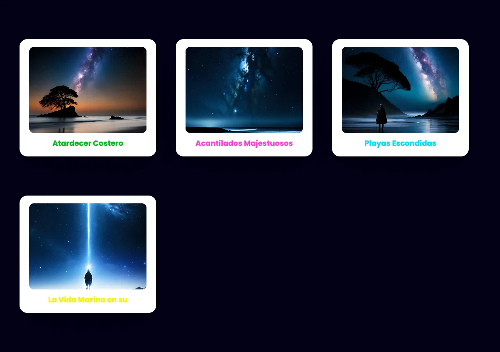

# ✨ Cards with Hover Effects – HTML + CSS

[](https://github.com/soyandresdev/the-frontend-projects)
[](/demo/01-css_cards_hover_effects/index.html)
[](https://github.com/soyandresdev/the-frontend-projects/tree/main/01-css_cards_hover_effects)
[](https://github.com/soyandresdev)
[](LICENSE)

Un microproyecto frontend que presenta tarjetas interactivas con efectos hover **solo con HTML y CSS**. Ideal para portfolios, galerías o secciones destacadas.

---

## ✨ Vista previa



---

## 🧠 Características

- 🎯 Efectos `hover` suaves y limpios sin JavaScript
- 🌈 Uso de `mix-blend-mode` para overlays creativos
- ⚡ Diseño responsive con **CSS Grid**
- 🧩 Estilizado con utilidades de **Tailwind CSS**
- 📱 Optimizado para dispositivos móviles

---

## 📥 Instalación y uso

```bash
# Clona este repositorio
git clone https://github.com/soyandresdev/the-frontend-projects

# Entra a la carpeta del proyecto
cd frontend-projects/workspace/01-css_cards_hover_effects

# Abre el archivo index.html en tu navegador
open index.html
```

> También puedes verlo en [la demo en vivo](/demo/01-css_cards_hover_effects/index.html)

---

## 🛠️ Tecnologías utilizadas

<div style="display:flex; gap:10px; flex-wrap: wrap;">
  
</div>

- HTML5 + CSS3
- Tailwind CSS
- CSS Grid
- Transiciones y transformaciones

---

## 📚 Estructura del proyecto

```
01-css_cards_hover_effects/
├── index.html
├── style.css
└── screenshot.webp
```

---

## 👨‍💻 Autor

**Andres Hernandez**  
📧 soyandresdev@gmail.com  
🌐 [GitHub Profile](https://github.com/soyandresdev)

---

## 🌐 Enlaces

- 🔗 [Código fuente](https://github.com/soyandresdev/the-frontend-projects/tree/main/01-css_cards_hover_effects)
- 🚀 [Demo en vivo](/demo/01-css_cards_hover_effects/index.html)

---

Made with ❤️ by [@soyandresdev](https://github.com/soyandresdev)
