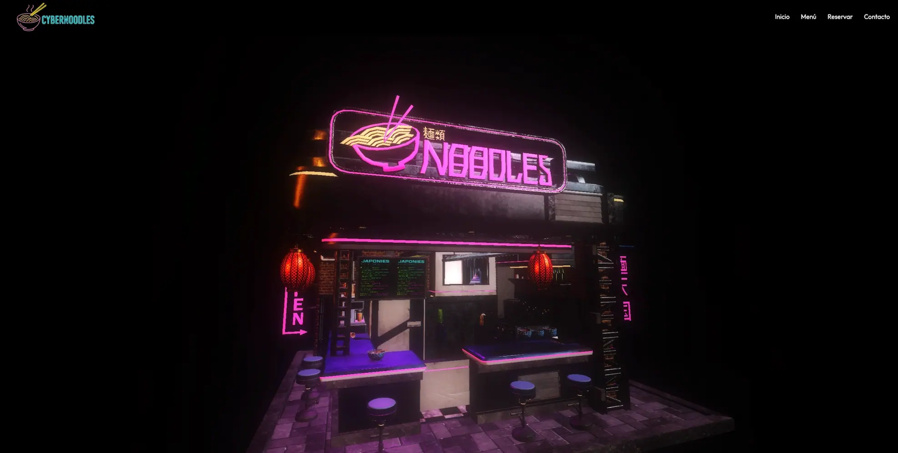

# 🍜 3D Restaurant Landing Page

[](https://github.com/soyandresdev/the-frontend-projects)
[](/demo/02-landingpage_3d_restaurant/index.html)
[](https://github.com/soyandresdev/the-frontend-projects/tree/main/02-landingpage_3d_restaurant)
[](https://github.com/soyandresdev)
[](LICENSE)

Una landing page atractiva e inmersiva para un restaurante ficticio, que incorpora un modelo 3D animado usando **Three.js** y efectos visuales modernos.

## ✨ Vista previa



## 🧠 Características

- 🎯 Modelo 3D interactivo en el header
- 🌈 Animaciones suaves y diseño responsive
- ⚡ Desarrollado con HTML, CSS, JavaScript y Three.js
- 🪄 Efectos de iluminación y ambientación
- 📱 Adaptado para móviles

## 📥 Instalación y uso

```bash
git clone https://github.com/soyandresdev/the-frontend-projects.git
cd frontend-projects/workspace/02-landingpage_3d_restaurant
open index.html
```

> También puedes verlo en [la demo en vivo](/demo/02-landingpage_3d_restaurant/index.html)

## 🛠️ Tecnologías utilizadas

<div style="display:flex; gap:10px; flex-wrap: wrap;">
  
</div>

- [Three.js](https://threejs.org/)
- WebGL
- HTML5 + CSS3
- Vanilla JavaScript

## 📚 Estructura del proyecto

```
02-landingpage_3d_restaurant/
├── index.html
├── style.css
├── main.js
├── assets/
│   ├── models/
│   ├── textures/
└── screenshot.webp
```

## 👨‍💻 Autor

**Andres Hernandez**  
📧 soyandresdev@gmail.com  
🌐 [GitHub Profile](https://github.com/soyandresdev)

## 🌐 Enlaces

- 🔗 [Código fuente](https://github.com/soyandresdev/the-frontend-projects/tree/main/02-landingpage_3d_restaurant)
- 🚀 [Demo en vivo](/demo/02-landingpage_3d_restaurant/index.html)

---

Made with ❤️ by [@soyandresdev](https://github.com/soyandresdev)
