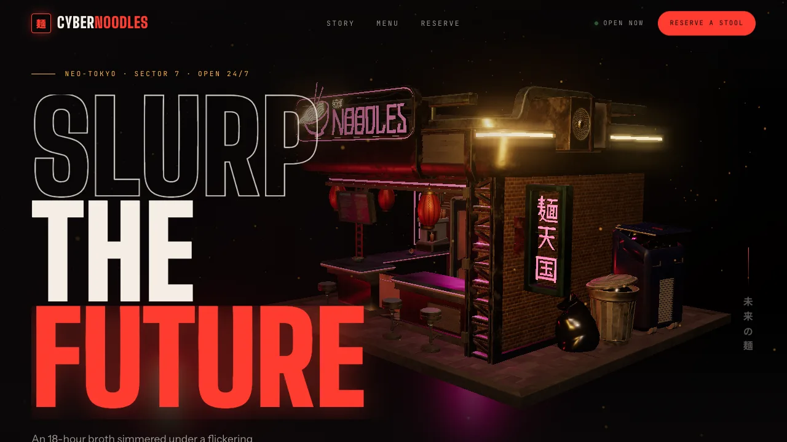

# 🍜 CyberNoodles — 3D Restaurant Landing

[](https://github.com/soyandresdev/the-frontend-projects)
[](/demo/02-landingpage_3d_restaurant/index.html)
[](https://github.com/soyandresdev/the-frontend-projects/tree/main/workspace/02-landingpage_3d_restaurant)
[](https://github.com/soyandresdev)
[](LICENSE)

Landing page de un kiosco de fideos cyberpunk. El modelo 3D vive en un canvas fijo detrás de la página y la **cámara se mueve con el scroll**: cada sección tiene su propia "estación" (posición, objetivo, rotación del modelo y FOV) y GSAP ScrollTrigger interpola entre ellas.

## ✨ Vista previa



## 🧠 Características

- 🎥 Cámara Three.js coreografiada por scroll (una estación por sección, scrub suavizado)
- ⏳ Preloader con porcentaje real de descarga del modelo y cortina de entrada
- 🔤 Hero con reveal de líneas enmascaradas y parallax de puntero sobre la escena
- 📖 Sección "Story" con relleno palabra por palabra (SplitText) ligado al scroll
- 🍜 Menú en galería horizontal fijada (pin) en escritorio, scroll-snap nativo en móvil
- 🔢 Contadores animados, formulario de reserva con estado de confirmación
- 🌫️ Bloom, niebla, partículas tipo brasa y parpadeo de neón en la escena
- ♿ `prefers-reduced-motion` respetado (sin parallax, sin scrub de cámara, sin marquee)
- 📦 Modelo comprimido con glTF-Transform (meshopt + WebP): de 115 MB a 3,4 MB

## 📥 Instalación y uso

```bash
git clone https://github.com/soyandresdev/the-frontend-projects.git
cd the-frontend-projects/workspace/02-landingpage_3d_restaurant
npm install
npm run dev
```

> También puedes verlo en [la demo en vivo](/demo/02-landingpage_3d_restaurant/index.html)

## 🛠️ Tecnologías utilizadas

<div style="display:flex; gap:10px; flex-wrap: wrap;">
  
</div>

- [Three.js](https://threejs.org/) — escena, GLTFLoader (meshopt), UnrealBloomPass
- [GSAP](https://gsap.com/) — ScrollTrigger, ScrollSmoother, SplitText
- [Vite](https://vitejs.dev/)
- HTML5 + CSS3 + Vanilla JavaScript

## 📚 Estructura del proyecto

```
02-landingpage_3d_restaurant/
├── index.html
├── src/
│   ├── main.js      # coreografía de scroll, estaciones de cámara, UI
│   ├── scene.js     # escena Three.js (luces, modelo, partículas, post)
│   └── style.css
├── public/assets/
│   ├── kiosk.glb
│   └── LICENSE-model.txt
└── screenshot.webp
```

## 🎨 Créditos

Modelo 3D: ["Cyberpunk Noodle Kiosk – Environment Prop"](https://sketchfab.com/3d-models/cyberpunk-noodle-kiosk-environment-prop-443d2448daf441ffa7cfdcce8169610e) por [Marina Belov](https://sketchfab.com/marinabelova), licencia [CC-BY-4.0](http://creativecommons.org/licenses/by/4.0/).

## 👨‍💻 Autor

**Andres Hernandez**  
📧 soyandresdev@gmail.com  
🌐 [GitHub Profile](https://github.com/soyandresdev)

---

Made with ❤️ by [@soyandresdev](https://github.com/soyandresdev)
