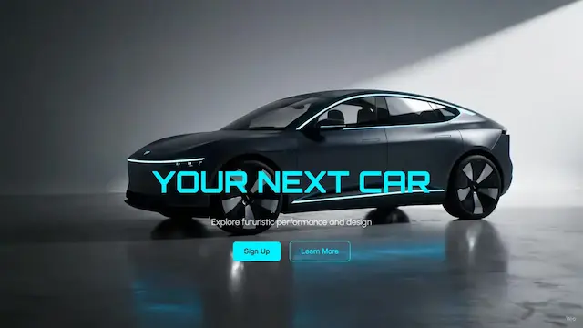

# 🚗 Neon Velocity – Futuristic Car Landing Page

[](https://github.com/soyandresdev/the-frontend-projects)
[](/demo/03-neon_velocity/index.html)
[](https://github.com/soyandresdev/the-frontend-projects/tree/main/03-neon_velocity)
[](https://github.com/soyandresdev)
[](LICENSE)

Una landing page futurista y profesional que simula una experiencia visual de marca para autos eléctricos de alta gama. Incluye efectos de parallax, animaciones con scroll, botones interactivos y un fondo animado tipo flipbook con imágenes 3D.

---

## ✨ Vista previa



---

## 🧠 Características

- 🎞️ Fondo animado con imágenes por scroll controlado (flipbook)
- 🌀 Parallax en la sección de galería y contenido flotante
- ⚡ Animaciones con GSAP y ScrollTrigger
- 💻 Diseño responsive y componentes modulares
- 📦 Estructura BEM y código limpio
- 🧠 UX coherente con temática futurista

---

## 📥 Instalación y uso

```bash
# Clona este repositorio
git clone https://github.com/soyandresdev/the-frontend-projects

# Entra a la carpeta del proyecto
cd frontend-projects/workspace/03-neon_velocity

# Abre el archivo index.html
open index.html
```

> También puedes verlo en [la demo en vivo](/demo/03-neon_velocity/index.html)

---

## 🛠️ Tecnologías utilizadas

<div style="display:flex; gap:10px; flex-wrap: wrap;">
  
</div>

- HTML5 + CSS3 (BEM)
- JavaScript (ESM)
- GSAP + ScrollTrigger
- WebP + SVG
- Diseño responsivo

---

## 📚 Estructura del proyecto

```
03-neon_velocity/
├── index.html
├── style.css
├── main.js
├── frames.js
├── /assets/
│   ├── frames/
│   ├── icons/
│   ├── *.webp
└── screenshot.webp
```

---

## 👨‍💻 Autor

**Andres Hernandez**  
📧 soyandresdev@gmail.com  
🌐 [GitHub Profile](https://github.com/soyandresdev)

---

## 🌐 Enlaces

- 🔗 [Código fuente](https://github.com/soyandresdev/the-frontend-projects/tree/main/03-neon_velocity)
- 🚀 [Demo en vivo](/demo/03-neon_velocity/index.html)

---

Made with ❤️ by [@soyandresdev](https://github.com/soyandresdev)
